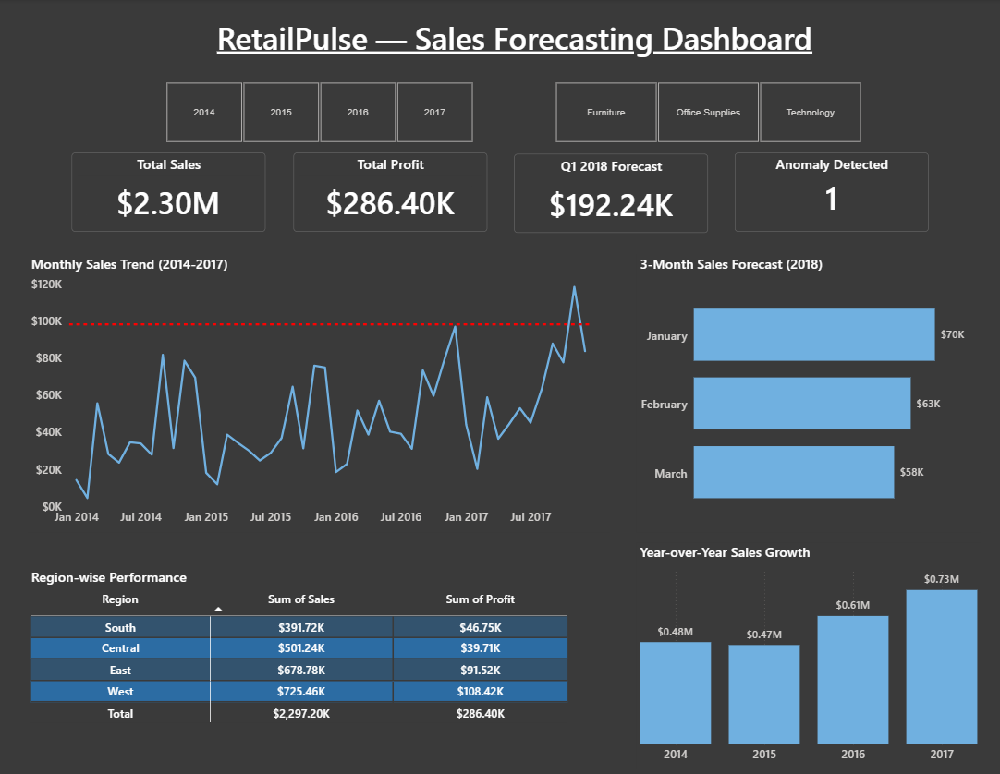

# 🎯 RetailPulse — End-to-End Sales Forecasting System


---

## 📊 Dashboard Preview



---

## 🚀 Project Overview

> Analyzed **4 years of retail sales data (2014–2017)** using Time Series Analysis.
> Built an **ARIMA forecasting model**, detected **sales anomalies**, and visualized
> everything in an **interactive Power BI dashboard**.

---

## 📌 Problem Statement

A US-based retail company needed answers to 3 key business questions:

| Question | Answer |
|----------|--------|
| 📈 How are sales trending? | Sales grew **51%** from 2014 to 2017 |
| 🔮 What will next quarter look like? | Q1 2018 forecast = **$192K** |
| 🚨 Were there unusual months? | **Nov 2017** — 20% above threshold! |

---

## 🔍 Key Results

```
📊 Dataset      → 9,994 orders | 4 years | 3 categories | 4 regions
📈 Growth       → 51% sales growth (2014 → 2017)
🏆 Top Category → Technology ($836K)
🌍 Top Region   → West ($725K)

🔮 Q1 2018 Forecast:
   January  → $70,398
   February → $63,344
   March    → $58,498
   Total    → $192,240

🚨 Anomaly → November 2017 ($118,448)
   → 20% above $98K statistical threshold
   → Cause: Holiday Season + Black Friday
   → Action: Replicate this strategy every year!
```

---

## 🗂️ Project Structure

```
retail-pulse-forecasting/
│
├── data/
│   ├── Sample - Superstore.csv       ← Raw dataset
│   ├── superstore_cleaned.csv        ← Cleaned dataset
│   ├── forecast.csv                  ← ARIMA forecast values
│   └── anomaly.csv                   ← Detected anomaly
│
├── notebooks/
│   ├── 01_EDA_and_Cleaning.ipynb
│   ├── 02_Time_Series_Decomposition.ipynb
│   ├── 03_Stationarity_and_ACF_PACF.ipynb
│   ├── 04_Forecasting_ARIMA.ipynb
│   └── 05_Anomaly_Detection.ipynb
│
├── sql/
│   ├── analysis.sql                  ← 6 business queries
│   └── data_loader.ipynb             ← PostgreSQL loader
│
├── dashboard/
│   └── retail_pulse.pbix             ← Power BI file
│
├── images/
│   └── retail_dashboard_image.png    ← Dashboard screenshot
│
└── README.md
```

---

## 📓 Notebooks Walkthrough

| # | Notebook | What I did |
|---|----------|------------|
| 01 | EDA & Cleaning | Explored 9,994 rows, fixed date formats, created time features |
| 02 | Decomposition | Split sales into Trend + Seasonality + Residual |
| 03 | Stationarity & ACF/PACF | ADF Test (p=0.0002), identified ARIMA(p=1, d=0, q=1) |
| 04 | ARIMA Forecasting | Trained model, forecasted Q1 2018, evaluated MAE/RMSE/MAPE |
| 05 | Anomaly Detection | Flagged Nov 2017 — 20% above statistical threshold |

---

## 🤖 ARIMA Model

| Parameter | Value | How I got it |
|-----------|-------|--------------|
| p | 1 | PACF Plot — lag 1 significant |
| d | 0 | ADF Test — data already stationary |
| q | 1 | ACF Plot — lag 1 significant |
| MAE | $25,761 | Model Evaluation |
| RMSE | $34,052 | Model Evaluation |
| MAPE | 32.18% | Model Evaluation |

> ⚠️ ARIMA(1,0,1) captures overall trend but misses seasonal spikes.
> **SARIMA** is recommended as a future improvement.

---

## 🗄️ SQL Analysis (PostgreSQL)

6 business queries covering:

```sql
1. Monthly Sales Trend
2. Category-wise Revenue & Profit
3. Top 5 Sub-categories by Sales
4. Region-wise Performance
5. Year-over-Year Growth
6. Worst Performing Sub-categories
```

---

## 🛠️ Tech Stack

| Tool | Purpose |
|------|---------|
| Python | Analysis + Modeling |
| Pandas & NumPy | Data manipulation |
| Matplotlib & Seaborn | Visualizations |
| statsmodels | ARIMA model |
| PostgreSQL | SQL analysis |
| Power BI | Interactive dashboard |

---

## ▶️ How to Run

```bash
# 1. Clone the repo
git clone https://github.com/aditya-datahub/retail-pulse-forecasting

# 2. Install dependencies
pip install pandas numpy matplotlib seaborn statsmodels scikit-learn

# 3. Run notebooks in order
# 01_EDA_and_Cleaning.ipynb → 02 → 03 → 04 → 05
```

---

## 📁 Dataset

**Source:** [Superstore Dataset — Kaggle](https://www.kaggle.com/datasets/vivek468/superstore-dataset-final)

- 9,994 orders | January 2014 — December 2017
- 21 features including Order Date, Sales, Profit, Category, Region

---

## 🔗 Connect with me

**Aditya Sharma — Data Analyst**

[](https://www.linkedin.com/in/aditya-sharma-9b6588286/)
[](https://github.com/aditya-datahub)

---

*⭐ If you found this project useful, please star the repo!*
